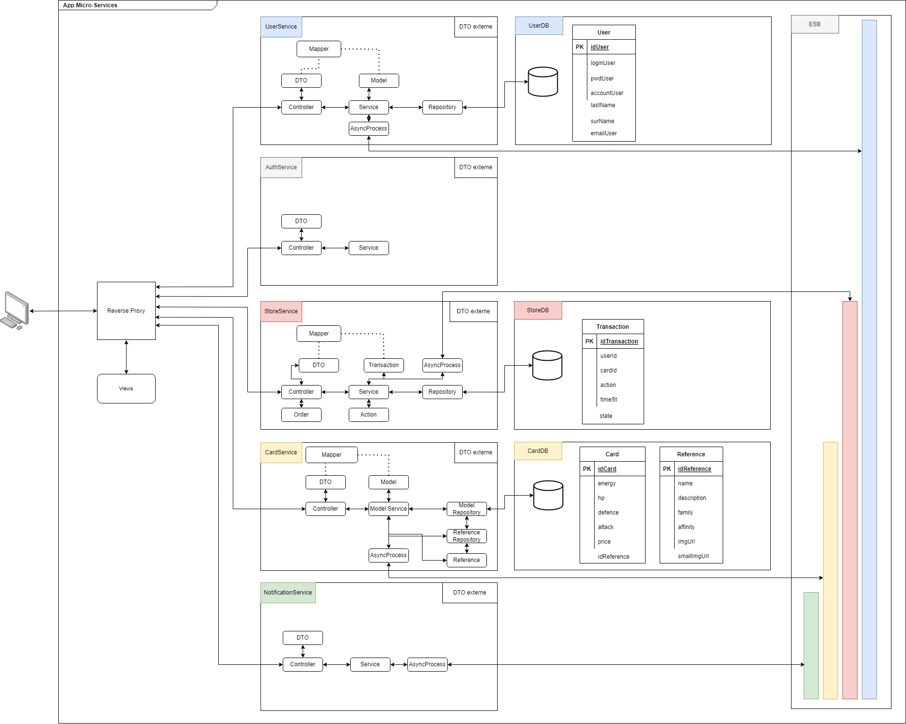

# ASI-2

ASI-2: Framework frontend, services orientés architecture (S9)

## Diagramme des micro-services :

## Liste requêtes :

| Type | Source | Destination | Requête                      | Attributs                        |
| ---- | ------ | ----------- | ---------------------------- | -------------------------------- |
| GET  | Client | Auth        | /api/auth/                   | user_id, mdp                     |
| GET  | Auth   | User        | /api/user/                   | user_id                          |
| GET  | Client | Store       | /api/store/buy/              | user_id, card_id                 |
| POST | Store  | Card        | /api/card/                   | idTransaction, card_id , user_id |
| POST | Store  | User        | /api/user/                   | idTransaction, user_id, money    |
| GET  | Card   | Store       | /api/store/transaction/card/ | idTransaction, card_id           |
| GET  | User   | Store       | /api/store/transaction/user/ | idTransaction, user_id           |
